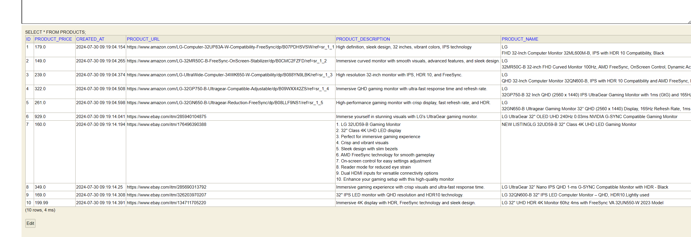

# Product Fetch Application

## Usage

### Fetch Products

To fetch products, use the following CURL request:

```bash
curl --location 'http://localhost:8080/v1/fetch/products?searchKey=Iphone15ProMax'
```

```json
[
  {
    "name": "For iPhone 15 14 13 12 11 Pro Max Shockproof Mag Safe TPU Case Camera Lens Cover",
    "url": "https://www.ebay.com/itm/387113635250",
    "price": 4.99,
    "source": "Ebay",
    "logo": "https://upload.wikimedia.org/wikipedia/commons/4/48/EBay_logo.png",
    "desc": "Described For iPhone 15 14 13 12 11 Pro Max Shockproof Mag Safe TPU Case Camera Lens Cover",
    "createdAt": "2024-08-05T12:21:09.988+00:00"
  }
]
```

Chat with AI

```bash
curl --location 'localhost:8080/ai/generate?message=%22List%203%20cities%20in%20India%22'
```

```json
{
    "generation": "1. New York City, New York\n2. Los Angeles, California\n3. Chicago, Illinois"
}
```

### Swagger Documentation

Swagger documentation is accessible at:

[http://localhost:8080/swagger-ui/index.html#/](http://localhost:8080/swagger-ui/index.html#/)

### H2 Data Persistence

H2 console can be accessed at:

[http://localhost:8080/h2-console](http://localhost:8080/h2-console)

- Database Name: `test`
- Username: `root`
- Password: `admin`
  

### OpenAI Integration

OpenAI is integrated to fill out the product description field. Currently, it returns a dummy response for testing
purposes.

## Known Issues

1. **Robot Detection**: CAPTCHA verification can cause Amazon scraping to fail sometimes.
2. **OpenAI**: Currently set to return a dummy response for testing purposes.
3. Availability - available / out of stock - stock availability is inconsistent from the search page across platforms.

## SortByPrice

The `sortByPrice` field in the CURL request can be set to either `asc` (ascending) or `desc` (descending) to sort the
products by price.
